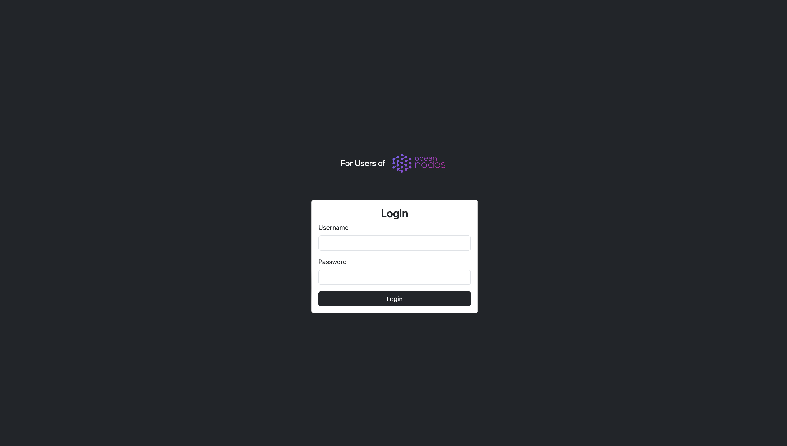
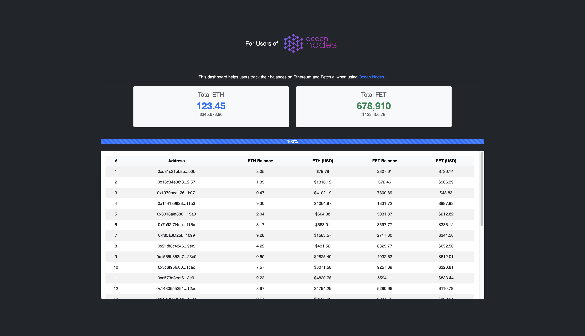

# Balances Dashboard

This project is a dashboard to monitor Ethereum (ETH) and Fetch.ai (FET) balances across multiple accounts (keys). It was created in response to [Ocean Nodes](https://github.com/oceanprotocol/ocean-node) to help users easily monitor their balances while interacting with the nodes. 

The dashboard retrieves real-time data from the Ethereum blockchain and Fetch.ai using Infura and displays balances and their corresponding USD values.

## Example





## Features

- **Track balances**: Easily monitor ETH and FET balances for multiple Ethereum addresses.
- **Price conversion**: Display current ETH and FET prices in USD using data from external API.
- **Real-time updates**: Progress bar to track the retrieval process.
- **Login protection**: A simple login system to protect the dashboard.

## Prerequisites

Before you start, make sure you have the following:

- **Node.js** (v14.x or higher) and **npm** installed.
- A free **Infura API Key** to connect to the Ethereum network.
- **Private Ethereum keys** to track your accounts.

## Installation

### Step 1: Clone the Repository

```bash
git clone https://github.com/Harky911/balance-dashboard.git
cd balance-dashboard
```

### Step 2: Install Dependencies

Once you are inside the project directory, install the required dependencies:

```bash
npm install
```

### Step 3: Set Up Environment Variables

You'll need to set up your environment variables for the application to function correctly.

1. Copy the `.env.example` file to a new `.env` file:

    ```bash
    cp .env.example .env
    ```

2. Open the `.env` file and fill in the required fields:

    - **LOGIN_REQUIRED**: Set to `true` to require a login.
    - **USERNAME**: The username for login.
    - **PASSWORD**: The password for login.
    - **INFURA_KEY**: Your Infura API key (see step below on how to get one).
    - **FET_CONTRACT_ADDRESS**: This is already set to the correct Fetch.ai contract address.
    - **PRIVATE_KEY_X**: Add your Ethereum private keys here to track balances.

### Step 4: Get an Infura API Key

To retrieve Ethereum balance information, you'll need an Infura API key:

1. Go to [Infura.io](https://infura.io) and sign up for a free account.
2. After registering, create a new project (choose Ethereum as the network).
3. Copy the project’s **API Key** and paste it into the `INFURA_KEY` field in your `.env` file.

### Step 5: Run the Application

To run the application:

```bash
npm start
```

This will start the application, and you can access it by navigating to `http://localhost:3000`.

### Step 6: PM2 Commands (Optional)

You can manage the application using **PM2** for production, but here are the most common commands:

- **Restart the Application:**

    ```bash
    pm2 restart balances-dashboard
    ```

- **Stop the Application:**

    ```bash
    pm2 stop balances-dashboard
    ```

- **Delete the Application from PM2:**

    ```bash
    pm2 delete balances-dashboard
    ```

## Folder Structure

```bash
/project-root
├── public/                 # Public assets (CSS, images, etc.)
├── views/                  # HTML templates for the dashboard and login page
├── .env                    # Environment variables (Not included in GitHub)
├── .env.example            # Example environment file for users
├── app.js                  # Main server file using Express
├── package.json            # Project metadata and dependencies
└── README.md               # Project documentation
```

## Contributing

Contributions are welcome! Please open an issue or submit a pull request if you'd like to contribute.
